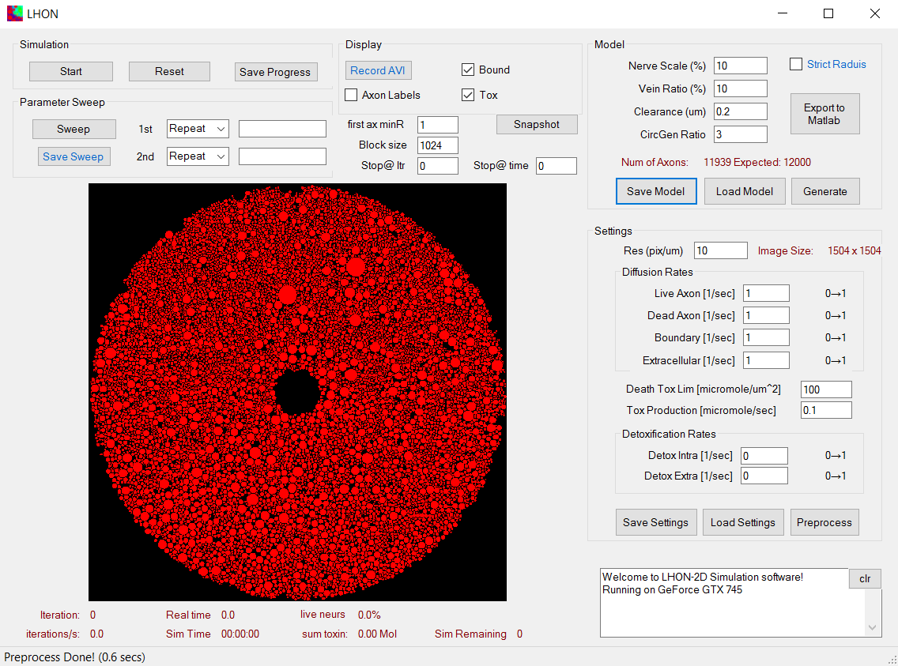

# LHON 2D Simulator

The simulation is implemented in `C#`/`C++` (Microsoft Visual Studio 2016). The open source [CUDAfy.NET](https://cudafy.codeplex.com/) package was used to integrate *NVidia* `CUDA` (`C++`) with our GUI in `C#`. The simulation of the propagation of injury from axon to axon was parallelized on an *NVidia* graphics card.

For more information about the project please refer to the publication:
[Propagation and Selectivity of Axonal Loss in Leber Hereditary Optic Neuropathy](https://github.com/p8me/p8me.github.io/blob/main/publications/2019-lhon-sci-rep.pdf).

### User Interface

### Demo 1

### Demo 2 

### Demo 3 

### Complete demo on youtube

